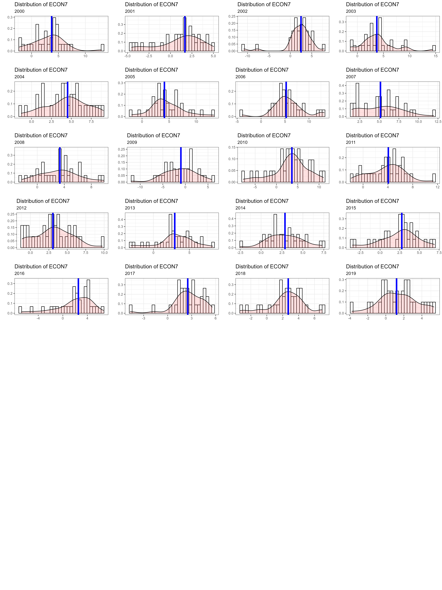

```{r setup, include=FALSE}
knitr::opts_chunk$set(echo = TRUE)
```

```{r echo=FALSE, message=FALSE, warning=FALSE}
library(openxlsx)
library(readxl)
library(tidyverse)
library(ggplot2)
library(gridExtra)
library(randomForest)
library(glmnet)
library(cowplot)
library(Boruta) #Feature selection
library(boot)
library(xgboost)
library(grid)
library(IRdisplay)
library(cowplot)
library(boot)
library(caret)
library(mboost)
library(ranger)
library(gam)
library(hrbrthemes)
library(cowplot)
library(kableExtra)
```

### Distributions of variables for all countries

To perform an aggregated analysis, as opposed to do it per country, we study the
distributions of our co-variables aggregated by county, for each year. 

#### Types of variables

To aggregate data, we inspect the measurement type of each co-variable. The following table presents this information:

```{r echo=FALSE, message=FALSE, warning=FALSE}
covariate_types <- as.data.frame(read.xlsx("./Imputed_data/Covariable_Types.xlsx"))

covariate_types %>% 
  mutate(across(everything(), ~cell_spec(.x, color = factor(covariate_types$Type,
                                                            labels =  c("#3366CC","#DC3912","#FF9900",
                                                                        "#66AA00", "#E377C2", "#8C564B",
                                                                        "#7F7F7F","#17BECF", "#990099")),
                                         link = "#",))) %>%
   kable("html", escape = F, align = "c") %>% 
   kable_styling("condensed", full_width = F) %>%
  scroll_box(height = "550px")
```

We can see that all co-variables deal with rates, percentages and indexes, except for total population co-variables such as `SOC1` through `SOC7`. We decided to perform the aggregation using means and medians for all variables, except for these, which either can be removed, or summed.

#### Distribution Inspection

The following code creates distribution plots for each variable at each year.

We read the data, remove redundant co-variables, and initialize some plotting values.

```{r echo=FALSE, message=FALSE, warning=FALSE}

Imputed_data <- as.data.frame(read.xlsx("./Imputed_data/Final_imputed_data_All.xlsx"))
ind_redundant <- which(Imputed_data$Indicator%in%c("COV16","COV17","COV18","COV19","COV20"))
Imputed_data <- Imputed_data[-c(ind_redundant),]
Data_used <- Imputed_data
variables <- unique(Data_used$Indicator)
colors <- c("#3366CC","#DC3912","#FF9900","#109618","#990099",
            "#0099C6","#DD4477","#66AA00","#B82E2E","#316395",
            "#1F77B4","#FF7F0E","#2CA02C","#D62728","#9467BD",
            "#8C564B","#E377C2","#7F7F7F","#BCBD22","#17BECF",
            "#4C78A8","#F58518","#E45756","#72B7B2","#54A24B",
            "#EECA3B","#B279A2","#FF9DA6","#9D755D","#BAB0AC",
            "#D62728","#9467BD","#8C564B","#1F77B4","#FF7F0E",
            "#2CA02C","#D62728","#9467BD","#8C564B","#E377C2",
            "#7F7F7F","#BCBD22")
```

We create a list of grid-plots per variable.

```{r echo=FALSE, message=FALSE, warning=FALSE}

list_of_figures_per_var <- list()

for (var in variables) {

  data_graph <- Data_used[which(Imputed_data$Indicator == var), ]
  years <- unique(data_graph$Year)
  list_of_figures <-list()
  
  for (year in years) {
  
    data_plot <- data_graph[which(data_graph$Year == year), ]
    median_line <- median(data_plot$Value)
    dist_plot <- ggplot(data_plot, aes(x=Value)) + 
      geom_histogram(aes(y=..density..),
                     colour="black", fill="white") +
      geom_density(alpha=.2, fill="#FF6666")+ geom_vline(
        xintercept = median_line, color = "blue", size=1.75) +
      ggtitle(paste("Distribution of ", var, sep=""))
    list_of_figures[[year]] <- dist_plot
  }
  
  plot_list <- lapply(names(list_of_figures), function(obj_name) {
    figure  <- list_of_figures[[obj_name]]
    # Add the title equal to the object's name
    figure +
      theme_bw() +
      labs(x = "", y = "", subtitle = obj_name)
  })
  # Arrange the plots in a grid using plot_grid
  # grid_plot <- plot_grid(plotlist = plot_list, nrow = 9 , ncol = 4)
  # ggsave(paste("./Figures/Distributions/Dist_Plot_",
  #              var, ".png", sep=""),
  #        grid_plot, width = 15, height = 20)
  list_of_figures_per_var[[var]] <- plot_list
}
```

We can see how some of these figures look like.

```{r echo=FALSE, message=FALSE, warning=FALSE}
list_of_figures_per_var$SOC2[[1]]
```

```{r echo=FALSE, message=FALSE, warning=FALSE}
list_of_figures_per_var$HEALTH15[[10]]
```

We stored the grid plots in the `./Figures/Distributions/` path of the main project.


This way we have the distribution of each variable per year, over all countries. 
This is useful for aggregate analysis.

We also created heatmaps and lineplots to further inspect the shape and attributes of each variable across countries and years.

```{r echo=FALSE, message=FALSE, warning=FALSE}

list_of_heatmaps_per_var <- list()
list_of_lineplots_per_var <- list()

for (var in variables) {

  data_graph <- Data_used[which(Imputed_data$Indicator == var), ]
  data_graph <- subset(data_graph, select = -c(Indicator))
  data_graph_pivot <- spread(data_graph, key = Year, value = Value)
  
  # Heatmap
  heatmap <- ggplot(data_graph, aes(Year, Country, fill=Value)) + 
    geom_tile() +
    ggtitle(paste("Heatmap of ", var, " for each country", sep="")) + 
    scale_fill_distiller(palette = "Spectral") +
    theme(
      axis.text.x = element_text(
        angle = 90,
        hjust = 1,
        vjust = 0.5
      ))
  
  lineplot <- ggplot(data_graph, aes(x=Year, y=Value, group=Country, color=Country)) +
    geom_line(linewidth=0.9) +
    ggtitle(paste("Time Series of ", var, " for each country", sep="")) +
    theme(
      axis.text.x = element_text(
        angle = 90,
        hjust = 1,
        vjust = 0.5
      )) + scale_color_manual(values=colors)
  
  # all_graph <- plot_grid(lineplot, heatmap, labels = "AUTO")
  # save_plot(paste("./Figures/HeatmapsLinePlots/Plot_", var, ".png", sep=""), all_graph, ncol = 2)
  list_of_heatmaps_per_var[[var]] <- heatmap
  list_of_lineplots_per_var[[var]] <- lineplot
}
```

Here's one example:

```{r echo=FALSE, message=FALSE, warning=FALSE}
list_of_lineplots_per_var$HEALTH3
```

```{r echo=FALSE, message=FALSE, warning=FALSE}
list_of_heatmaps_per_var$HEALTH3
```

### Creation of aggregate data

To create aggregate data (that is, at the region level), for each Year we group all the countries in for each variable and compute the mean, the median, the weighted mean and the weighted median. The weights are computed with the total population (variable `SOC5`) of the given region at a particular year. We have three region classifications:

- **Ubication**: Continent, Island.
- **Region**: North, Center, South, Island.
- **SubRegion**: Andean Area, Brazil, Central America, Latin Caribbean, Mexico, Non Latin Caribbean, North America, Southern Cone. These are the sub-regions specified by PAHO: [PAHO Dashboard Subregions](https://opendata.paho.org/en/core-indicators/subregions-dashboard).

For example let's see the aggregate code applied to the *SubRegion* classification.

```{r echo=FALSE, message=FALSE, warning=FALSE}

region_column <- "SubRegion"
population_variable <- "SOC5"

Imputed_data_0 <- as.data.frame(
  read.xlsx("./Imputed_data/Final_imputed_data_All_with_Regions.xlsx"))

cat(paste("Aggregating by ", region_column, " ... \n"))

Imputed_data <- Imputed_data_0[, c("Country",
                                   "Indicator",
                                   "Year",
                                   "Value",
                                   region_column)]

if(region_column != "Region"){
  Imputed_data$Region <- Imputed_data[, c(region_column)]
}

Imputed_data <- Imputed_data[, c("Country",
                                 "Indicator",
                                 "Year",
                                 "Value",
                                 "Region")]

Aggregate_Data <- data.frame()
region_values <- unique(Imputed_data$Region)

for (region_use in region_values) {
  
  cat(paste("Processing ", region_use, " ... \n"))
  
  # Population Data
  pop_data <- Imputed_data[Imputed_data$Indicator == "SOC5",
                           c("Country", "Year", "Value", "Region")]
  
  pop_data <- pop_data[pop_data$Region == region_use,
                       c("Country", "Year", "Value")]
  colnames(pop_data) <- c("Country", "Year", "Population")
  total_pop <- pop_data %>% group_by(Year) %>%
    summarise(TotalPop=sum(Population), .groups = 'drop')
  pop_data <- merge(pop_data, total_pop, by.x=c("Year"),
                    by.y=c("Year"), all.x=TRUE)
  pop_data$PopWeight <- pop_data$Population/pop_data$TotalPop
  
  var_data <- Imputed_data[Imputed_data$Indicator != "SOC5", ]
  var_data <- var_data[var_data$Region == region_use, ]
  variables_region <- unique(var_data$Indicator)
  
  Aggregate_Data_Region <- data.frame()
  
  for (var in variables_region) {
    
    # cat(paste("Processing ", var, " for ", region_use, " ... \n"))
    
    indicator_data <- var_data[which(var_data$Indicator == var), ]
    indicator_data <- merge(indicator_data, pop_data, by.x=c("Country", "Year"),
                            by.y=c("Country", "Year"), all.x=TRUE)
    
    indicator_data$WeightedValueRaw <- indicator_data$Value * indicator_data$PopWeight
    
    Aggregate_Data_Region_Indicator <- indicator_data %>% group_by(Year, Region) %>%
      summarise(MedianValue=median(Value),
                WeightedValue=sum(WeightedValueRaw),
                MeanValue=mean(Value), .groups = 'drop')
    
    Aggregate_Data_Region_Indicator$Indicator <- var
    
    Aggregate_Data_Region <- rbind(Aggregate_Data_Region, Aggregate_Data_Region_Indicator)
    
  }
  
  Aggregate_Data <- rbind(Aggregate_Data, Aggregate_Data_Region)
  
}
```

To check computations, for example let's inspect the values of region `Southern Cone` at year 2000 for indicator `SOC13`:

```{r echo=FALSE, message=FALSE, warning=FALSE}
data_ <- Imputed_data_0[Imputed_data_0$SubRegion == 'Southern Cone', ]
data_ <- data_[data_$Year == 2000, ]
data_ <- data_[data_$Indicator %in% c("SOC5", "SOC13"), ]
data_ <- data_ %>% 
    pivot_wider(names_from = Indicator, values_from = Value)
kable(data_)%>%
  kable_styling(full_width = FALSE)%>%
  kable_styling(font_size = 14)
```

To compute the weights we divide the populations of each country by the total population of in this region over that year.

```{r echo=FALSE, message=FALSE, warning=FALSE}
total_pop_region <- sum(data_$SOC5)
data_$Weights <- data_$SOC5/total_pop_region
data_$SOC13_Weighted <- data_$SOC13 * data_$Weights
kable(data_)%>%
  kable_styling(full_width = FALSE)%>%
  kable_styling(font_size = 14)
```

Which gives us the following four values for year `2000` at `Southern Cone`:

```{r}
median <- median(data_$SOC13)
weighted_value <- sum(data_$SOC13_Weighted)
mean <- mean(data_$SOC13)
cat(paste(median, weighted_value, mean))
```

Which agrees with the values at the computed aggregated data:

```{r echo=FALSE, message=FALSE, warning=FALSE}
kable(head(Aggregate_Data,1))%>%
  kable_styling(full_width = FALSE)%>%
  kable_styling(font_size = 14)
```

Note that the total population variables (`SOC1`, ... `SOC7`) are not present in this data, only `SOC5` which is used for the weighted values:

```{r echo=FALSE, message=FALSE, warning=FALSE}
unique(Imputed_data_0$Indicator)
```

```{r echo=FALSE, message=FALSE, warning=FALSE}
unique(Aggregate_Data$Indicator)
```

The `MainFileRegion` document contains the code to fit the models to aggregate data.
