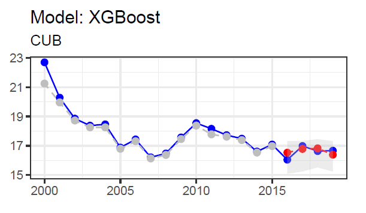

```{r setup, include=FALSE}
knitr::opts_chunk$set(echo = TRUE)
```

```{r echo=FALSE, message=FALSE, warning=FALSE}
library(openxlsx)
library(readxl)
library(tidyverse)
library(ggplot2)
library(gridExtra)
library(randomForest)
library(glmnet)
library(cowplot)
library(Boruta) #Feature selection
library(boot)
library(xgboost)
library(grid)
library(IRdisplay)
library(cowplot)
library(boot)
library(caret)
library(mboost)
library(ranger)
library(gam)
library(hrbrthemes)
library(cowplot)
library(kableExtra)
```

### Model Fitting and Evaluation

In this section we explain the procedure to tune, fit, evaluate and save the different models created for each country/region. 

#### Code organization

The code organization for this task corresponds to the following structure in [our github repository](https://github.com/yurygarcia26/SDG3_Projections):

- MainFileCountry.Rmd: Runs the model fitting, evaluation and saving for each country.
- MainFileRegion.Rmd: Runs the model fitting, evaluation and saving for each region.
- Functions
  - Modeling. This folder contains a function to fit each model type and to store the results of the model fit. Each function receives the training and testing data and performs a tuning of the model's hyper-parameters. The best model according to the `RMSE` metric is obtained with `caret` tunegrid functionality. For the best model, this function returns model the selected final_features, their weights. Here are the current models implemented.
    - Boost_gam.R
    - Boost_glm.R
    - Lasso.R
    - RandomForest.R
    - RFRanger.R
    - XGBoost.R
  - Results
    - ConfidentIntervalGeneral.R: creates prediction intervals arround predicted values for the best selected model. This appends the columns `upper_bound` and `lower_bound` to the testing data (which already has the response and prediction columns). We explain below the bootstraping procedure to compute these prediction intervals.
    - Est_Metrics.R: The `Est_Metrics_function` computes the RMSE and MAE from prediction and observed values. 
    - GetResultsGeneral.R: This function performs the general fit, evaluate, save algorithm for a given country and returns the main results and figure. We explain this algorithm in here.
    - PlotResultsGeneral.R: The `plot_function` creates the time series graphs that show the real values of the Outcome time series (in blue), the fitted values on the training data (in gray), and the predicted values of the testing data (in red). We show these graphs below.
- Figures: Results of Predictions and Models, visualizations on the data structure (variable distributions, ...).
- Imputed_Data: Base data for the analysis, compiled in the Data Extraction phases of this project.

#### Main procedure

The main algorithm starts with the data in a long format such as the following.

```{r echo=FALSE, message=FALSE}
Imputed_data<- as.data.frame(read.xlsx(
    "../Imputed_data/Final_imputed_data_All.xlsx"))
kable(head(Imputed_data, 10))%>%
  kable_styling(full_width = FALSE)%>%
  kable_styling(font_size = 14)
```

Then, the data is filtered by each country or region and a series of regression models are tested using a training/testing split approach. The main function, given as follows, obtains and saves the results for each country. Here's an example using the Outcome_name = 'SUICM' (The other two are 'SUICF' and 'CovIndex').

```{r eval=FALSE}

Outcome_name <- 'SUICM'

Imputed_data<- as.data.frame(read.xlsx(
    "./Imputed_data/Final_imputed_data_All.xlsx"))

# Change the Indicator values to Outcome, when the Indicator = "SUICM"
Imputed_data$Indicator[
  which(Imputed_data$Indicator== Outcome_name)] <- "Outcome"

# Remove CovIndex and SUICF
ind_CovIndex <-which(Imputed_data$Indicator=="CovIndex")
ind_suicF <- which(Imputed_data$Indicator=="SUICF")}
Imputed_data <- Imputed_data[-c(ind_suicF,ind_CovIndex),]

# Data to use
Data_used <- Imputed_data

# Identify the total countries in the file
list_of_countries <- unique(Data_used$Country)

list_of_figures           <-list()  # Save the prediction for each country
list_of_relevant_var      <-list()  # Save selected variables
list_of_final_prediction  <-list()
info_df <- data.frame()
list_of_metrics_by_country <- data.frame()

for(country in list_of_countries){
  
  tryCatch({
    
    # Decide if you want to add hyper parameter tuning or
    # cross validation to the model fit
    
    hyper_tune <- TRUE
    cv         <- TRUE
    
    results_country <- get_results(country, "Country", Data_used,
                                   hyper_tune, cv, Outcome_name)
    
    # general info
    info_df <- rbind(info_df, results_country$info_df_)
    
    # figures
    list_of_figures[[country]] <- results_country$figure_[[1]]
    
    # save metrics  
    final_metrics = results_country$metrics_ 
    final_metrics$Country = country
    
    list_of_metrics_by_country<-rbind(list_of_metrics_by_country, final_metrics)
    
    # save predictions to plot later
    list_of_final_prediction[[country]]<-results_country$figure_[[2]]
    
  }, error = function(err){
    
    cat(paste("Error computing results for ", country, " ", err, "\n"))
    
  })
  
}
```

The reader can note the call to the function `get_results`. This is the function that gives us the best model results for each country. We explain how this function works in the next subsection. The previous code gives us the following lists and dataframes:

1. `list_of_figures`: a figure for each country of the following format: a time series with the real values in a blue line, the fitted values for training data in a gray line and the predicted values for testing data in red. Also the prediction intervals are highlighted with gray and the best model and country are in the title. The training period of all models is all available years before 2015, and the testing period is between 2016 and 2019. Each figure looks like this:

<center>

{width=50%}

</center>

2. `info_df`: a dataframe that holds the following information for each country/region: total number of variables available for this country/region, the final most relevant variables selected for the model, the name of the best model selected for the country/region, a feature importance rate for each of the relevant variables selected and a best_s (for the $\lambda$ parameter in case the Lasso model was the best model selected). Here's a snippet of how this dataframe looks like:

```{r echo=FALSE}
sample <- as.data.frame(read.xlsx(
    "../Figures/Country_Results/Relevant_var_SUICM_Country.xlsx"))
kable(head(sample, 20))%>%
  kable_styling(full_width = FALSE)%>%
  kable_styling(font_size = 14) %>% 
  scroll_box(height = "550px")
```

3. `list_of_metrics_by_country`: This contains RMSE and MSE measurements for each model at each country/region. For each country we have a metric dataframe such as the following.

```{r echo=FALSE}
sample <- as.data.frame(read.xlsx(
    "../Figures/Country_Results/Relevant_var_SUICM_Country.xlsx", 2))
kable(head(sample, 20))%>%
  kable_styling(full_width = FALSE)%>%
  kable_styling(font_size = 14) %>% 
  scroll_box(height = "550px")
```

4. `list_of_final_prediction`: each prediction made for each country stored in a dataframe that has the year (between 2016 and 2019) and the prediction values.

These lists and dataframes are consequently saved in the summarizing files in the `./Figures/` folder.

```{r eval=FALSE}

### Write results ========================================== ###

today <- Sys.Date()
# Create a list of plots using your figures
plot_list <- lapply(names(list_of_figures), function(obj_name) {
  figure  <- list_of_figures[[obj_name]]
  # Add the title equal to the object's name
  figure +
    theme_bw() +
    labs(x = "", y = "", subtitle = obj_name)
})
# Arrange the plots in a grid using plot_grid
grid_plot <- plot_grid(plotlist = plot_list, nrow = 9 , ncol = 4)

# Display the grid of figures
figure <- grid_plot
ggsave(paste("./Figures/Country_Results/All_Predictions_", Outcome_name,
             "_Country.pdf",sep=""), figure, width = 15, height = 20)

# Save info and metrics in a single excel file.
result_list <- list(
  "Model_Info"=info_df,
  "Metrics"   =list_of_metrics_by_country)

write.xlsx(result_list, paste("./Figures/Country_Results/Relevant_var_", 
                              Outcome_name, "_Country.xlsx", sep=""))

write.xlsx(list_of_final_prediction,
           paste("./Figures/Country_Results/Final_predictions_",
                 Outcome_name, "_Country.xlsx", sep=""))
```

This is the main code that runs all the comparisons.

#### Model computation

We saw that the code goes through each country and obtains the best model fit, predictions and hyperparameters, and then it merges them all to create the final summaries. In this section we explain how the model selection procedure is done.

```{r eval=FALSE}
get_results <- function(region, region_col, Data_used, hyper_tune, cv, Outcome_name){

  start_time <- Sys.time()
  cat(paste(" ==== ", region, " ==== \n"))

  # Reshape the file, each column equal to one indicator
  Data_by_region       <- Data_used%>%filter(!!as.symbol(region_col)==region)
  Data_by_region_wider <- Data_by_region %>% pivot_wider(names_from = Indicator, values_from = Value)

  # Step 2: Define training and testing data
  training_data <- Data_by_region_wider%>%filter(Year%in%2000:2015)
  testing_data  <- Data_by_region_wider%>%filter(Year%in%2016:2019)

  best_s <- 1

  # Step 3: Estimate predictions with each model
  # Add more models as needed ...

  model_names <- c("Random Forest", "Lasso", "XGBoost", "Boost_glm", "Boost_gam")

  # Random Forest
  rf_results    <- random_forest_function(region_col, training_data, testing_data, hyper_tune=hyper_tune, cv=cv)

  # Lasso
  Lasso_results <- Lasso_function(region_col, training_data, testing_data, hyper_tune=hyper_tune, cv=cv)
  
  # XGBoost (put inside capture output to avoid long logs)
  cat("Tunning XGBoost \n")
  xgboost_output <- capture.output(xgboost_results <- XGBoost_function(region_col, training_data, testing_data, hyper_tune=hyper_tune, cv=cv))
  cat("XGBoost done \n")

  # Boost glm
  Boost_glm_results <- Boost_glm_function(region_col, training_data, testing_data, hyper_tune=hyper_tune, cv=cv)

  # Random forest ranger for time series
  # rfranger_results <- rfRanger_function(region_col, training_data, testing_data, hyper_tune=hyper_tune, cv=cv)
  
  # GAM Boot
  cat("Tunning GAM Boost \n")
  gam_Boost_results <- Boost_gam_function(region_col, training_data, testing_data, hyper_tune=hyper_tune, cv=cv)
  cat("GAM Boost done \n")

  model_results_all <- list(rf_results, Lasso_results, xgboost_results, Boost_glm_results, gam_Boost_results)

  # Step 4: Estimate the metrics
  metrics_models <- data.frame("metrics"=c("MAE", "RMED"))
  for (i in c(1:length(model_results_all))) {
    metrics_models[paste("model", i, sep="")] = Est_Metrics_function(model_results_all[[i]]$Predictions)
  }

  # Step 5: Identify the best model
  min_column        <- apply(subset(metrics_models, select=-c(metrics)), 1, which.min)[[2]]
  final_method_name <- model_names[min_column]
  cat(paste("Best model: ", final_method_name, " \n"))
  
  model_results_use <- model_results_all[[min_column]]
  model_results     <- model_results_use$Predictions

  model_selected = model_results_use$model
  
  if(final_method_name == 'Lasso'){
    best_s = model_results_use$best_s # In case of lasso model
  }

  saveRDS(model_selected, paste("./Models/best_model_", region, "_", Outcome_name, ".rds", sep=""))

  # Save information by region
  info_df_region <- data.frame(
                              Total_Variables    = length(unique(Data_by_region$Indicator)), # Total initial variables
                              Relevant_Var       = model_results_use$features, # Selected variables
                              Selected_feat      = length(model_results_use$features),
                              method             = final_method_name)

  info_df_region[region_col] <- rep(c(region),each=dim(info_df_region)[1])
  info_df_region$best_s_lasso <- rep(c(best_s),each=dim(info_df_region)[1])

  tryCatch({
    info_df_region$Selected_feat_importance <- model_results_use$importances
  }, error = function(err){
    cat(paste("Error putting selected_feat_importance ", err, " Using", final_method_name, " \n"))
  })

  # Step 6: Compute Confident Intervals
  cat("Confidence Intervals computing ... \n")
  model_result_CI = CI_function(model_results, training_data, testing_data, info_df_region, region, region_col, best_s, Outcome_name)
  # Corrected CI_function
 
  # Step 7: Save figure
  method_selected = info_df_region$method[nrow(info_df_region)]
  cat("Plot computing ... \n")
  figure_region <- plot_function(Data_by_region_wider, model_results_use$Fit, model_result_CI, 
                                              method_selected, add_fit=TRUE)
  
  end_time <- Sys.time()
  cat(paste(region_col, " ", region, " took ", end_time-start_time, " minutes \n", sep=""))
  cat(" =============== \n")

  return(list(figure_=figure_region,
  info_df_=info_df_region,
  metrics_=metrics_models,
  model_result_CI=model_result_CI))

}
```

We summarize the steps that this function performs.

1. Filter the original data to use only the country/region in question.
2. Pivot data to make the `Indicator` variable into columns. One column will be called `Outcome`.
3. Split the data into training and testing data using the corresponding periods (years 2000 to 2015 is training data, years 2016 to 2019 is testing data).
4. Run the **model function** for each of the available model types. To this date the models to test are: Lasso, Random Forest, XGBoost, Boost_GAM and Boost_GLM. Each **model function** returns the same list parameters: \
  4.1 `model`: a `caret` object already trained with the training data using the model method. \
  4.2 `Fit`: the result of the model fit over the training data (this is a numeric vector of length equal the size of training data).\
  4.3 `Predictions`: the result of the model predictions over the testing data (this is a numeric vector of length equal the size of testing data).\
  4.4 `features`: number of relevant variables selected by the best model.\
  4.5 `importances`: an importance score for each of the relevant variables selected by the best model.\
5. Select the model with the minimum RMSE. 
6. Save this model as a `.rds` file for future use.
7. Create the `info_df` dataframe for this country/region.
8. Compute prediction intervals using the final model.
9. Compute figure using this model.
10. Return the corresponding parameters: `figure`, `info_df`, `metrics` and the prediction intervals computation (`model_result_CI`).

Each **model function** (`random_forest_function`, `lasso_function`, `XGBoost_function`, `Boost_glm_function`, `Boost_gam_function`) has the same structure and uses the same method to compute the best model. All of these functions use the `caret` package for hyperparameter tuning by means of a grid search with a crossed validation setting. Here's the grid control used for Random Forest model, for example.

```{r eval=FALSE}
control <- trainControl(method="repeatedcv", number=5, repeats=3, search="grid")
tunegrid <- expand.grid(mtry = seq(1, dim(X_train)[2], by = 3))
model_train <- train(X_train, y_train,
                    method="rf", 
                    metric=metric,
                    tuneGrid=tunegrid,
                    trControl=control,
                    ntree = 1000)
```

After this initial model fitting, the **model function** will perform a feature selection based on the importance scores the model assigned to each variable. The selection is forward: starting with only the most important variable we continue to append other variables until the RMSE score of the model with the selected variables so far doesn't decrease. The following code snippet illustrates this procedure.

```{r eval=FALSE}
# Extract feature importance scores
importance_scores <- varImp(model_train, scale=FALSE)$importance
importance_scores <- data.frame(features=row.names(importance_scores),
                                importance=importance_scores$Overall)
importance_scores <- importance_scores%>%arrange(desc(importance))
importance_scores_no_zero <- importance_scores[importance_scores$importance>0,]


for (threshold in 3:(nrow(importance_scores_no_zero))) {
  
  # Select the top N important features
  selected_features <- importance_scores_no_zero$features[1:threshold]
  selected_features_importances <- importance_scores_no_zero$importance[1:threshold]
  
  # Subset the training and testing data with selected features
  X_train_selected <- subset(X_train, select = selected_features)
  X_test_selected  <- subset(X_test, select = selected_features)
  
  if (cv){
    model_train_selected <- train(X_train_selected, 
                                  y_train,
                                  method   ="rf", 
                                  metric   =metric,
                                  trControl=control,
                                  tuneGrid =tunegrid,
                                  ntree = 1000)
  } else {
    model_train_selected <- train(X_train_selected, 
                                  y_train,
                                  method  ="rf", 
                                  metric  =metric,
                                  tuneGrid=tunegrid,
                                  ntree  = 1000)
  }
  
  # Make predictions on the testing data/training data
  fit         <- predict(model_train_selected, newdata=X_train_selected)
  predictions <- predict(model_train_selected, newdata=X_test_selected)
  
  # Evaluate the model's performance for this threshold
  accuracy <- sqrt(mean((y_test - predictions)^2))
  
  # Check if this model has the best accuracy so far
  if(accuracy < best_accuracy) {
    training_data$Fit        <- fit
    testing_data$Prediction  <- predictions
    best_accuracy            <- accuracy
    best_threshold           <- threshold
    final_features           <- selected_features
    final_features_weights   <- selected_features_importances
    final_model              <- model_train_selected
  }
  
}
```

This procedures varies for Lasso, in which important features are selected using Lasso's internal selection algorithm (based on the $\lambda$ value).

#### Confidence Interval computation

The bootstrap method for prediction intervals is based in part from [Kumar, S.; and Srivastava, A. 2012. **Bootstrap prediction intervals in non-parametric regression with applications to anomaly detection**. In *Proc. 18th ACM SIGKDD Conf. Knowl. Discovery Data Mining*](https://ntrs.nasa.gov/citations/20130014367). Also a nice explanation for this method can be found in [this video by James Scott](https://www.youtube.com/watch?v=c3gD_PwsCGM).

This method consists of the following steps:

1. Take a sample with replacement of the training data and train the corresponding model (with the current hyperparameters) in this training sample.
2. Compute this sub-model fit over training data sample.
3. Compute the errors of this fit.
4. Sample `nrow(testing_data)` errors from these fit errors.
5. Compute prediction of sub-model on testing data.
6. Add sample of errors to prediction.
7. Repeat this procedure many times.
8. Compute the 2.5% and 97.5% quantiles of all of these perturbed predictions, this gives you the upper and lower levels for the 95% confidence prediction interval.

The code below shows how this method would work in the case of a Random Forest model. 

```{r eval=FALSE}
CI_function <- function(model_result, training_data, testing_data, info_df, region, region_col, best_s, Outcome_name){

   # List all files in the folder
  folder_path <- file.path(getwd(), "Models")
  # Construct the file path
  file_name <- paste0("best_model_", region, "_", Outcome_name, ".rds")
  file_path <- file.path(folder_path, file_name)
  model     <- readRDS(file_path)

  # Set a seed for reproducibility
  set.seed(123)  
  data_region      <- info_df%>%filter(!!as.symbol(region_col)==region)
  selected_features <- data_region$Relevant_Var
  method            <- data_region$method[1]
  n_samples         <- 100

  bootstrap_predictions <- matrix(0, nrow = n_samples, ncol = dim(testing_data)[1])

  tryCatch({
  for (i in 1:n_samples) {
    
    # Split the data into training and validation sets
    train_indices <- sample(1:nrow(training_data), size = 0.8 * nrow(training_data))
    X_train_split <- training_data[train_indices, selected_features]
    y_train_split <- training_data[train_indices, "Outcome"]
    
        
    rf_model <- randomForest(y_train_split$Outcome ~ ., 
                             data = X_train_split,
                             mtry = model$bestTune$mtry,ntree=1000)
        
    # Compute Bootstrapped predictions
    # 1. Fit over training data partition
    fit <- predict(rf_model, newdata = X_train_split)
    # 2. Compute errors
    errors <- fit - y_train_split$Outcome
    # 3. Sample dim(testing_data) errors with replacement
    sample_errors <- sample(errors, size=nrow(testing_data), replace=TRUE)
    # 4. Predict this sub-model over testing data
    predictions <- predict(rf_model, newdata = testing_data[, selected_features])
    # 5. Sum predictions and errors
    bootstrapped_predictions <- predictions + sample_errors
    # Same procedure for all other models
 
    bootstrap_predictions[i, ] <- bootstrapped_predictions
  }

  # Calculate the 95% prediction interval for prediction
  lower_bound <- apply(bootstrap_predictions, 2, function(x) quantile(x, 0.025))
  upper_bound <- apply(bootstrap_predictions, 2, function(x) quantile(x, 0.975))

  model_result$lower_bound<-lower_bound
  model_result$upper_bound<-upper_bound

  return(model_result)

  }, error = function(err){
    
    cat(paste("Error computing confidence intervals for ", region, " ", err, "\n"))
    cat("Will use std \n")
    uncertainty <- sd(model_result$Prediction)
    model_result$lower_bound <-model_result$Prediction - uncertainty
    model_result$upper_bound <-model_result$Prediction + uncertainty
    return(model_result)

  })

}   
```
